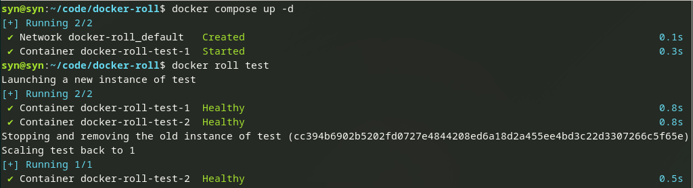

# Docker Roll 🚤

Performs a zero-downtime rollout of SERVICE using docker-compose scale SERVICE=2



## Installation
```
mkdir -p ~/.docker/cli-plugins && \
    curl -Lso ~/.docker/cli-plugins/docker-roll https://github.com/synchrone/docker-roll/raw/master/docker-roll && \
    chmod +x ~/.docker/cli-plugins/docker-roll
```


